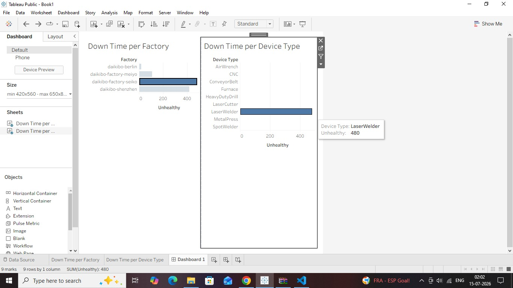

# Deloitte Australia Data Analytics Virtual Experience (Forage)

## Overview

Completed the Deloitte Australia Data Analytics Virtual Experience Program on Forage. This simulation provided hands-on experience in data visualization, business analysis, and forensic technology by solving practical business problems using Tableau and Microsoft Excel.

The virtual experience consisted of two industry-based tasks that simulated the work of Deloitte's Data Analytics and Forensic Technology teams.

---

## Tasks Completed

### Task 1 – Data Analysis

**Objective:** Build an interactive Tableau dashboard to analyze telemetry data collected from Daikibo's manufacturing factories.

**Completed Work:**
- Imported and analyzed telemetry data from four Daikibo factories:
  - Daikibo Factory Meiyo (Tokyo, Japan)
  - Daikibo Factory Seiko (Osaka, Japan)
  - Daikibo Berlin (Berlin, Germany)
  - Daikibo Shenzhen (Shenzhen, China)
- Created a calculated field to measure machine downtime.
- Built interactive Tableau visualizations:
  - Down Time per Factory
  - Down Time per Device Type
- Combined the visualizations into a dashboard with interactive filtering.
- Identified the factory with the highest machine downtime and the machine types contributing most to the downtime.

---

### Task 2 – Forensic Technology

**Objective:** Support Deloitte's Forensic Technology team in investigating potential gender pay inequality.

**Completed Work:**
- Analyzed employee equality score data in Microsoft Excel.
- Applied Excel formulas to classify equality scores into appropriate categories.
- Prepared the dataset to support the investigation into workplace pay equality.
- Generated structured data suitable for business reporting and further analysis.

---

## Tools & Technologies

- Tableau
- Microsoft Excel
- Data Visualization
- Dashboard Development
- Data Analysis
- Business Analytics

---

## Repository Contents

- Tableau Dashboard Screenshot
- Completed Equality Score Analysis (Excel)

---

## Skills Demonstrated

- Data Visualization
- Dashboard Development
- Microsoft Excel
- Data Analysis
- Business Reporting
- Business Insight Generation
- Analytical Thinking

---

## Dashboard Preview

---

## About

This repository contains my completed work for the Deloitte Australia Data Analytics Virtual Experience Program hosted on Forage. The tasks focused on creating an interactive Tableau dashboard to analyze manufacturing telemetry data and using Microsoft Excel to support a forensic technology investigation into workplace pay equality.
